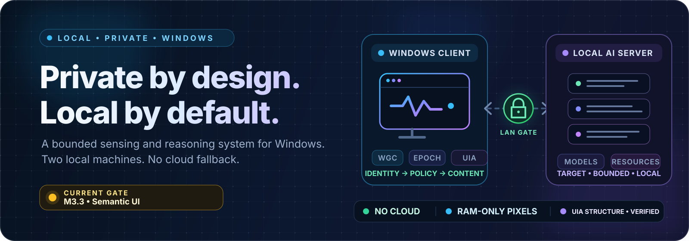
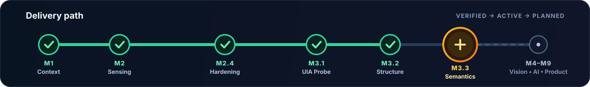
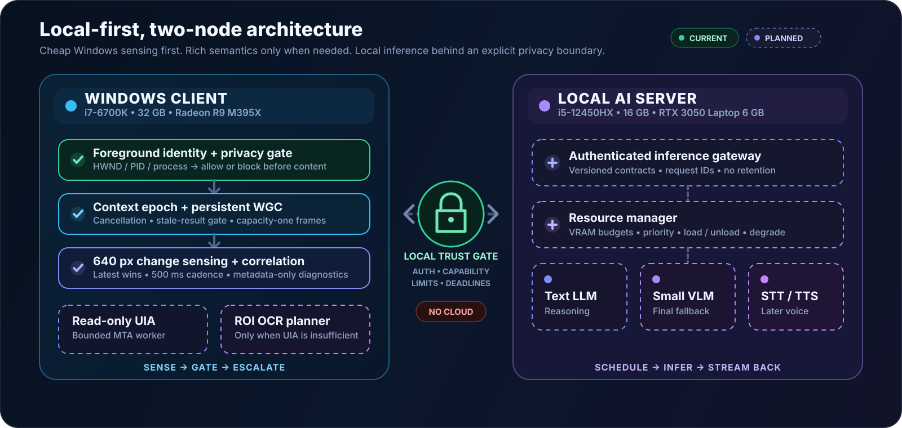

<p align="center">
  
</p>

<h1 align="center">Local AI Desktop Copilot</h1>

<p align="center">
  <strong>A privacy-first, fully local Windows copilot that observes, understands, remembers, listens, and answers.</strong>
</p>

<p align="center">
  
  
  
  
  
  <a href="https://github.com/tahazarif10/local-ai-desktop-copilot/actions/workflows/ci.yml"></a>
</p>

<p align="center">
  <a href="docs/PROJECT_STATE.md">Project State</a> ·
  <a href="docs/ARCHITECTURE.md">Architecture</a> ·
  <a href="docs/PRIVACY_MODEL.md">Privacy</a> ·
  <a href="docs/ROADMAP.md">Roadmap</a> ·
  <a href="docs/ENGINEERING_WORKFLOW.md">Engineering Workflow</a> ·
  <a href="docs/decisions/README.md">ADRs</a>
</p>

<p align="center">
  
</p>

This is a product-grade system, not a screenshot-to-LLM demo. It uses the smallest useful local context, escalates from cheap sensing to richer semantics only when required, and treats privacy as a control-plane boundary.

> [!IMPORTANT]
> The accepted `main` baseline includes the M3.1 metadata-only UI Automation root probe and M3.2 bounded, non-text structural snapshots. Draft [PR #18](https://github.com/tahazarif10/local-ai-desktop-copilot/pull/18) contains an M3.3 semantic-snapshot candidate, but it is not accepted or merged until the physical Windows matrix passes. OCR, memory, model inference, voice, autonomous actions, and a production privacy-settings UI do not exist.

## Project status in 60 seconds

| Item | Current truth |
| --- | --- |
| Last verified functional code baseline | `e1a50741580379f0f65c80e212f04c449e5a8c9b` (the later `2677025` descendant changes only the diagnostic milestone label) |
| Accepted merge record | M3.2 [PR #16](https://github.com/tahazarif10/local-ai-desktop-copilot/pull/16), squash merge `be0a437`; resolve live HEAD from GitHub/Git |
| Active unaccepted candidate | M3.3 [Draft PR #18](https://github.com/tahazarif10/local-ai-desktop-copilot/pull/18), functional head `3dccdbc`; automated gates pass, physical Windows acceptance remains open |
| Baseline date | 2026-08-23 (Windows runtime acceptance) |
| Completed | Foreground context, RAM-only capture, capability privacy/epochs, low-resolution change detection, persistent latest-wins sensing, diagnostic correlation, portable core/CI, application-owned lifecycle, launch-scoped diagnostics/input hardening, root-only UIA probing, and bounded non-text UIA structure |
| Current implementation shape | Existing packaged WinUI process with one application-owned COM MTA, one active plus one newest pending request, generated UIA interop, and short-lived bounded Control View results; there is no separate UIA process |
| Active milestone | `M3.3 Semantic UI Snapshot`; branch `dev/m3-3-semantic-ui-snapshot`; implementation candidate complete, physical acceptance next |
| Accepted M3.2 contract | Foreground HWND only; breadth-first Control View; Content subset marker; 256 nodes / depth 8 / 1,200 ms / 27 properties per node / zero strings / 32 KiB estimated result |
| Automated tests / CI | Accepted M3.2: 108/108 in [CI #28](https://github.com/tahazarif10/local-ai-desktop-copilot/actions/runs/32648315641). Active M3.3 candidate: 124/124 on Ubuntu/Windows, PowerShell parse, and strict `Debug/win-x64 --warnaserror` build in [CI #40](https://github.com/tahazarif10/local-ai-desktop-copilot/actions/runs/32652845504) |
| Cloud use | Forbidden by the product architecture |
| Autonomous input/actions | Out of scope |

The detailed, evidence-backed state is in [Project State](docs/PROJECT_STATE.md). Do not infer implementation status from the target architecture or roadmap.

<p align="center">
  
</p>

## Start here in a new AI or engineering session

Read these files in order before proposing code:

1. [AGENTS.md](AGENTS.md) — repository rules and source-of-truth order.
2. [Project State](docs/PROJECT_STATE.md) — what is implemented, verified, missing, and next.
3. [Architecture](docs/ARCHITECTURE.md) — current and target boundaries, data flow, threading, queues, and failure handling.
4. [Privacy Model](docs/PRIVACY_MODEL.md) — mandatory gates and data-lifetime rules.
5. [Roadmap](docs/ROADMAP.md) — milestone sequence and exit criteria.
6. [Engineering Workflow](docs/ENGINEERING_WORKFLOW.md) — build, diagnosis, runtime acceptance, and Git process.
7. [Architecture decisions](docs/decisions/README.md) — durable reasons behind non-obvious choices.

A new session should fetch the live repository and first report its branch, exact HEAD, working-tree status, last functional code commit, current milestone, next gate, and any mismatch between documentation and code. A commit cannot truthfully embed its own future squash SHA, so live Git is authoritative for current HEAD. Chat history is context, not the repository source of truth.

## Product goal

The final product should let a user ask a natural question such as “Why did this error appear?” without manually capturing or explaining the screen. The answer must be produced locally from the smallest useful context.

The system is intentionally hierarchical:

<p align="center">
  
</p>

UI Automation, OCR, and vision are escalation levels, not parallel always-on collectors. A direct user question may request a fresh bounded context snapshot, but it still passes through the same privacy and epoch gates.

## Fixed two-computer deployment target

The architecture is designed for the hardware already available. Hardware upgrades are not an architectural assumption.

| Node | Fixed hardware | Intended responsibility |
| --- | --- | --- |
| Windows client | Intel i7-6700K, 32 GB RAM, AMD Radeon R9 M395X | Foreground detection, privacy gates, Windows capture, cheap change detection, UI Automation, lightweight preprocessing, user interface |
| Local AI server | Lenovo LOQ 15IAX9, Intel i5-12450HX, 16 GB RAM, RTX 3050 Laptop GPU 6 GB, Windows 11 Pro | Local model runtimes, resource scheduling, text/VLM inference, and later STT/TTS |

The server is a local-LAN trust boundary, not “the cloud.” Nothing may cross from the client to the server without an explicit privacy capability, size/deadline limits, cancellation, and an authenticated local protocol. That protocol is not implemented yet.

## Non-negotiable invariants

- Priority order: **Correctness > Reliability > Privacy > Performance > Maintainability**.
- Target product sensing is explicit and defaults to OFF. The accepted Arm/Disarm path stops and restarts foreground observation, capture, and input tracking as one application-owned lifecycle.
- Process identity is evaluated before title, pixels, UIA text, OCR, memory, or network access.
- A blocked context produces no title read, capture, UIA, OCR, memory, or network request.
- Every asynchronous result is bound to a context epoch and discarded if stale.
- Normal capture frames remain in RAM and are disposed promptly; screenshots are not written to disk.
- Diagnostic logs contain metadata, not raw titles, UIA/OCR text, keys, coordinates, audio, screenshots, or model prompts.
- Volatile state streams are bounded and latest-wins; no unbounded frame or event queues.
- UI Automation is read-only. Invoke, SetValue, selection changes, mouse control, keyboard automation, and autonomous actions are forbidden.
- OCR and VLM work only on demand or after a meaningful trigger; VLM is never the default sensing loop.
- Performance claims require measurements on the fixed target hardware.

See [Privacy Model](docs/PRIVACY_MODEL.md) for the exact current-versus-target distinction.

## What works today

The accepted desktop ownership path is:

```text
App
  -> ApplicationCompositionRoot
  -> DesktopCopilotCoordinator (services, subscriptions, lifecycle)
  <-> MainPage (commands + immutable view state only)
```

The preserved M2 sensing path is:

```text
WinEvent foreground hook
  -> HWND/PID/process identity
  -> privacy evaluation
  -> explicit Arm
  -> immutable ContextEpoch + cancellation
  -> 200 ms settle
  -> persistent Windows Graphics Capture
  -> capacity-one latest-frame ownership
  -> 640 px luminance sample every 500 ms
  -> Baseline / Insignificant / Meaningful / Large
  -> optional diagnostic correlation with mouse/keyboard activity kind
```

The accepted M3.1 path is:

```text
explicit diagnostic launch + Arm
  -> ReadUiStructure capability gate
  -> immutable epoch/HWND/PID request
  -> one active + one coalesced newest pending request
  -> lazy dedicated COM MTA thread
  -> HWND/PID revalidation + same-or-lower integrity check
  -> CUIAutomation8 / IUIAutomation2 timeout-bounded ElementFromHandle
  -> release root pointer on the worker
  -> typed metadata-only outcome
  -> current epoch/capability publication gate
```

The M3.1 probe never requests UIA Name, Value, Text, tree children, patterns, or actions. Product-default launches do not grant `ReadUiStructure`; the grant exists only inside an explicit launch-scoped diagnostic session.

Accepted M3.2 extends that same gated request path with a breadth-first Control View snapshot. It uses an Element-scope UIA cache request and generated `IUIAutomation2` interop, records only structural Boolean/numeric facts and pattern availability, and exposes `IsContentElement` for selective downstream use. The hard defaults are 256 nodes, depth 8, 1,200 ms traversal, 27 values per node, 6,912 total values, zero strings/bytes, and a 32 KiB estimated result. UI and diagnostics receive only aggregate counts/timing/truncation; no bounds, control IDs, per-node facts, or text are logged.

The activity tracker records only `MouseClick`, `MouseWheel`, or `KeyboardActivity` plus an epoch and monotonic timestamp. It does not record keys, text, mouse coordinates, clipboard data, or target controls. M2.4.4 measured 1,965 callbacks across four physical hook lifetimes with zero callback/subscriber errors, zero installing-thread mismatches, successful keyboard/mouse unhook, a weighted mean of 92.8 microseconds, and a maximum of 929.8 microseconds; the current synchronous diagnostic-only hook path therefore remains accepted.

Current stack: C#/.NET 10, packaged WinUI 3, Windows App SDK 2.4.0, Win2D 1.4.0, Windows Graphics Capture, and accepted private build-time CsWin32 0.3.321 generation for UIA. Only the explicit `Debug/win-x64` path has runtime acceptance. Model/OCR/STT/TTS backends are not selected yet; early candidate names are not commitments.

## Build and diagnostic entry points

From PowerShell 5.1 or newer on the Windows client:

```powershell
dotnet test .\tests\LocalCopilot.Core.Tests\LocalCopilot.Core.Tests.csproj -c Release --settings .\tests\LocalCopilot.Core.Tests\.runsettings
dotnet build .\src\LocalCopilot.App\LocalCopilot.App.csproj -c Debug -r win-x64
```

The core suite does not require WinUI, capture, global hooks, a live UI Automation provider, or a desktop. The Windows app build and physical probe remain separate required checks because portable tests validate queue/gate/classification logic, not COM ABI or provider behavior.

For an explicit diagnostic session:

```powershell
.\run-debug.ps1

# Optional: choose another diagnostic root.
.\run-debug.ps1 -DiagnosticRoot "D:\LocalCopilotDiagnostics"
```

Run the diagnostic command from a normal, non-Administrator PowerShell. The runner fails closed if the shell is elevated so the app cannot inherit administrator integrity and invalidate the M3.1 security matrix.

`run-debug.ps1` creates one ignored, session-specific directory under `.localcopilot\diagnostics` by default, performs the strict Windows build, launches the packaged app with an expiring diagnostic token, runs a metadata-only foreground probe, and copies the final bundle to the clipboard. There is no persistent diagnostic-enable flag. The bundle reads only `session-meta.txt`, `app.log`, and `os-foreground.log` from that exact session.

For the full acceptance and Git workflow, use [Engineering Workflow](docs/ENGINEERING_WORKFLOW.md).

## Repository layout

```text
.
├── .github/
│   └── workflows/
│       └── ci.yml
├── AGENTS.md
├── README.md
├── run-debug.ps1
├── docs/
│   ├── assets/
│   ├── ARCHITECTURE.md
│   ├── ENGINEERING_WORKFLOW.md
│   ├── PRIVACY_MODEL.md
│   ├── PROJECT_STATE.md
│   ├── ROADMAP.md
│   └── decisions/
├── src/
│   ├── LocalCopilot.Core/
│   │   ├── Diagnostics/
│   │   └── Services/
│   └── LocalCopilot.App/
│       ├── Services/
│       ├── MainPage.xaml
│       └── MainPage.xaml.cs
└── tests/
    └── LocalCopilot.Core.Tests/
```

`LocalCopilot.App` and `LocalCopilot.Core` are separate assemblies but still run in one desktop process. The larger multi-project/process boundaries in the architecture remain targets to introduce only when their milestone requires them.

## License

[MIT](LICENSE)
