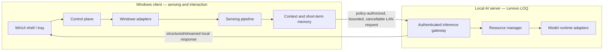
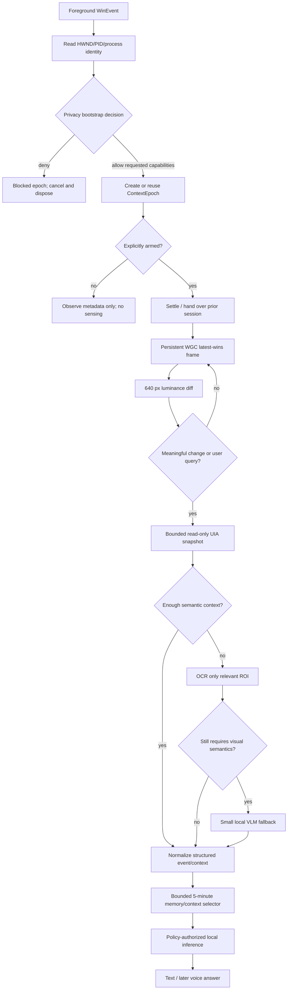

# Architecture

## 1. Purpose and status

This is the approved target architecture for a product-grade, local-only Windows desktop copilot. It also maps that target onto the smaller implementation currently present in the repository.

The target architecture is not permission to build every component now. The roadmap introduces boundaries only when an evidence-backed milestone needs them. The verified M2 sensing path should evolve incrementally rather than be rewritten.

Architecture priority is:

```text
Correctness > Reliability > Privacy > Performance > Maintainability
```

Privacy remains an architectural invariant even though correctness and reliability determine whether the privacy policy can be trusted and enforced.

## 2. Product contract

The product may:

- observe an explicitly enabled Windows desktop context;
- identify meaningful state changes cheaply;
- understand accessible UI and visible text;
- retain a short, bounded event history;
- answer screen-related questions with local models;
- later accept and return local voice.

The product may not:

- control mouse or keyboard;
- invoke or mutate another application's controls;
- operate autonomously;
- send content, telemetry, audio, screenshots, or memory to a cloud service;
- silently widen sensing after a policy or context change;
- rely on a hardware upgrade or an always-available large model.

## 3. Fixed deployment topology

The system is local but distributed across two fixed machines.



| Node | Fixed resources | Responsibilities |
| --- | --- | --- |
| Client | i7-6700K, 32 GB RAM, AMD R9 M395X | Windows identity/events, privacy, epoch lifecycle, WGC, cheap change detection, UIA, ROI preparation, lightweight OCR candidate if measured suitable, UI/voice device access |
| AI server | Lenovo LOQ 15IAX9, i5-12450HX, 16 GB RAM, RTX 3050 Laptop GPU 6 GB, Windows 11 Pro | Local protocol endpoint, model loading, resource scheduling, text/VLM inference, later STT/TTS |

The local server is a separate trust and egress boundary. “Fully local” does not mean “implicitly allowed to transmit everything over LAN.”

The original one-machine RTX 3060 assumption is obsolete. Backend choices must be measured on this two-node hardware.

## 4. Control plane and data plane

### 4.1 Control plane

The control plane decides whether work may exist:

```text
Global activation state
  -> foreground identity
  -> privacy capability decision
  -> context epoch
  -> cancellation / deadlines / resource budget
  -> stage eligibility
```

It owns:

- explicit Off / Armed / Paused state;
- per-application policy;
- context epochs and cancellation;
- orchestration state;
- resource mode and priority;
- operation budgets;
- permission to persist or cross the LAN boundary.

No sensing or semantic stage may bypass it.

### 4.2 Data plane

The data plane carries short-lived, typed artifacts:

```text
identity facts
  -> capture/change facts
  -> UIA/OCR/vision facts
  -> normalized events
  -> bounded short-term context
  -> inference request/response
```

Every content-bearing artifact must include at least:

- `EpochId`;
- source/provenance;
- monotonic and wall-clock observation time where needed;
- privacy/sensitivity classification;
- creation and expiry/lifetime information;
- bounded payload size;
- request/correlation ID for cross-boundary operations.

A stage must revalidate the epoch and required capability before publishing, retaining, displaying, or transmitting its result.

## 5. End-to-end sensing and understanding flow



There are two valid escalation triggers:

1. **Background trigger:** a foreground transition or meaningful visual/semantic change while armed.
2. **User-query trigger:** a high-priority request for a fresh, bounded context snapshot.

A user query can bypass waiting for the next background change, but it cannot bypass privacy, epoch, data-size, resource, or network gates.

## 6. Logical components

### 6.1 Activation and privacy policy

Responsibilities:

- default sensing OFF;
- global pause/microphone mute;
- per-process policy;
- capability-specific authorization;
- fail-closed decisions and rule provenance.

Current implementation has a revisioned capability-based `PrivacyPolicy` with strict emergency-deny, exact-application, and global-grant precedence. Capability and policy revision participate in epoch identity; existing title, capture, and diagnostic-retention call sites request their own permission. A settings UI and persisted policy store are not yet implemented. See [Privacy Model](PRIVACY_MODEL.md).

### 6.2 Foreground context service

Responsibilities:

- receive foreground changes via WinEvent;
- read only bootstrap identity (`HWND`, PID, process name) before policy;
- reject own-process and transient shell targets;
- read title only when explicitly allowed;
- produce a stable identity for epoch comparison.

The existing `ForegroundWindowObserver` coalesces pending HWND notifications and dispatches into the WinUI queue. This behavior is accepted.

### 6.3 Context epoch manager

An epoch is an immutable lifetime boundary for one foreground identity plus one privacy decision. Changing HWND, PID, policy/rule, or relevant activation state cancels the prior epoch.

Epoch cancellation is necessary but not sufficient: an operation must also compare its epoch to the currently active epoch before publication. This protects against libraries that finish after cancellation.

See [ADR 0002](decisions/0002-context-epochs-and-stale-results.md).

### 6.4 Windows capture adapter

Windows Graphics Capture is the pixel source. Current accepted behavior:

- window target, not whole-desktop capture;
- `Direct3D11CaptureFramePool.CreateFreeThreaded`;
- cursor disabled when supported;
- two WGC buffers, but only one application-owned latest frame;
- old buffered frame disposed immediately;
- 640 px maximum output width and 500 ms sampling cadence;
- GPU resize, CPU readback, luma conversion, CPU diff;
- pool recreation and detector reset after dimension changes;
- raw frames remain in RAM and are disposed.

The 640/500 profile is a measured baseline, not a permanent universal constant. Change only after a benchmark on the client.

### 6.5 Change detector

`ChangeDetector` reports pixel/tile magnitude and a bounding region. Its labels are transport/control classifications:

- Baseline
- Insignificant
- Meaningful
- Large

They do **not** mean “error,” “dialog,” or “important user event.” Semantic meaning belongs to later UIA/OCR/vision/event stages.

### 6.6 Input activity correlation

The current low-level hooks record only activity kind and monotonic time within an active epoch. Correlation means “possible recent trigger,” never asserted causality.

Future event records must preserve that uncertainty. Do not turn `MouseClick within 2 s` into “the click caused this change.”

The callbacks must remain constant-time and content-free. Microsoft notes that low-level hooks can be silently removed after callback timeout and recommends dedicated-thread handoff or Raw Input for robust monitoring; M2.4 measures before replacing the accepted implementation.

### 6.7 UI Automation semantic reader

UIA is read-only and starts at M3. It must:

- run outside the WinUI thread on a dedicated COM MTA worker;
- resolve only the current foreground HWND root;
- prefer Control View and selectively use Content View;
- avoid unbounded Raw View traversal;
- batch property retrieval with UIA cache requests;
- enforce node, depth, elapsed-time, string-byte, and result-size budgets;
- return typed unavailable/timeout/cancelled/stale outcomes;
- never call action methods or control patterns that mutate target UI;
- not request elevation or `uiAccess`.

UIA properties are cross-process calls and providers vary in quality. `CancellationToken` alone cannot be assumed to interrupt a blocked COM call. M3 must measure recovery and decide whether the continuous reader needs a restartable helper process.

### 6.8 OCR and visual fallback

OCR operates on a relevant region after UIA is insufficient. Backend selection is deferred to an M4 benchmark.

As of the architecture review on 2026-08-21, Microsoft's newer Windows AI Text Recognition API lists NPU-only OCR support. Neither fixed machine has that target NPU, so it is not the default plan. Legacy Windows OCR and third-party local candidates must be compared on accuracy, mixed Persian-English, latency, resources, packaging, and cancellation.

VLM is the final fallback for visual relationships that structured accessibility/text cannot express. It must not run on every frame or every meaningful diff.

### 6.9 Structured event pipeline

Semantic sources produce versioned facts which an event normalizer combines without losing provenance or uncertainty. Example event categories may include foreground change, dialog appeared, error text appeared, operation completed, or notification appeared, but the schema is not implemented yet.

The event pipeline must distinguish:

- volatile snapshots that may be replaced;
- discrete events that require bounded retention/deduplication;
- explicit user questions that must receive backpressure or a visible rejection rather than silent drop.

### 6.10 Short-term memory and context selection

MVP memory is bounded and approximately five minutes:

- structured events first;
- RAM-only initially;
- TTL and maximum counts/bytes;
- no raw screenshots;
- policy-authorized derived text only;
- clear on user command and relevant policy revocation;
- relevance selection rather than dumping history into a prompt.

Long-term semantic memory is not part of the MVP.

### 6.11 Local inference gateway

The client should know contracts and capabilities, not model-library details. The future gateway provides:

- protocol/version negotiation;
- authenticated encrypted LAN transport;
- request IDs, epoch, deadlines, cancellation, and size limits;
- health and model capability reporting;
- streamed text/audio response;
- no internet fallback.

The concrete transport and runtime remain undecided until M6. An architecture invariant is not a premature library choice.

### 6.12 Resource manager

The server resource manager owns model residency and concurrency for the 6 GB RTX 3050 Laptop GPU. Required operating states:

- `Normal`
- `LowResource`
- `UserQuery`
- `HeavyGpuApp`

User questions outrank background enrichment. Under pressure the system should reduce background frequency, skip VLM, use text-only context, unload models, or return a clear degraded outcome. It must not destabilize the user's primary application.

### 6.13 Voice pipeline

Voice is a later, independently gated pipeline:

```text
microphone -> lightweight VAD -> activation decision -> local STT
  -> context selector -> reasoning -> local TTS
```

Audio has its own permission, mute state, retention rule, and instrumentation. Ambient conversations must not cause arbitrary assistant responses.

## 7. Current versus target physical boundaries

### 7.1 Current repository

Today there are two production assemblies in one desktop process plus a portable test project:

```text
LocalCopilot.App
  App + ApplicationCompositionRoot (process/window composition and lifetime)
  DesktopCopilotCoordinator (integration, subscriptions, commands, view state)
  MainPage (diagnostic rendering + command forwarding)
  Windows adapters (WinEvent, WGC, Win32 input)
        |
        v
LocalCopilot.Core
  privacy policy, epochs, lifecycle gate, change classification,
  timeline/correlation models

LocalCopilot.Core.Tests -> LocalCopilot.Core
```

The split deliberately keeps deterministic logic out of the WinUI target so it can be characterized without XAML, capture, hooks, UI Automation, or a live desktop. It does not add a process or trust boundary. `App` creates and owns one coordinator; the coordinator owns long-running sensing resources and service subscriptions; `MainPage` attaches/detaches only as an `IDesktopCopilotView` and forwards user commands. `DiagnosticLog` temporarily lives in Core to preserve accepted diagnostic behavior without introducing a logging refactor in M2.4.1; its static, fixed-path design remains M2.4.4 debt.

### 7.2 Incremental target

Logical boundaries, introduced only at their roadmap gate:

```text
LocalCopilot.App                WinUI/tray, commands, presentation
LocalCopilot.Core               policy, epochs, events, orchestration contracts
LocalCopilot.Windows            WinEvent/WGC/input adapters
LocalCopilot.UIA.Worker         restartable read-only UIA boundary if M3 evidence requires it
LocalCopilot.Inference.Contracts versioned client/server DTOs
LocalCopilot.Inference.Server   local endpoint, resource manager, runtime adapters
*.Tests                         pure, contract, and Windows integration suites
```

M2.4.1 established the portable test boundary and M2.4.2 separated application composition/lifecycle from the page. Later milestones must not create all future projects at once.

## 8. Threading and lifecycle model

| Work | Required execution context |
| --- | --- |
| WinUI rendering and commands | WinUI dispatcher thread |
| Foreground WinEvent callback | Callback thread; minimal work, coalesce and dispatch |
| Low-level input callback | Constant-time classification and handoff only |
| WGC `FrameArrived` | Free-threaded callback; take ownership and replace latest frame only |
| Resize/readback/luma/diff | Background worker, never `FrameArrived` or UI thread |
| UIA calls and subscriptions | Dedicated COM MTA worker; subscription removal on same worker |
| Event normalization/memory | Single-owner worker or explicitly synchronized bounded pipeline |
| Local inference | AI server worker with deadlines/resource arbitration |

Application lifetime, not page navigation, owns the current long-running services. The accepted M2.4.2 implementation uses a one-shot lifecycle gate and this concrete shutdown sequence:

1. mark the coordinator stopped so new commands/foreground events are rejected;
2. remove the foreground hook on its installing UI thread;
3. disarm and stop the active persistent capture session;
4. stop content-free input tracking and reset the diagnostic timeline;
5. reset/cancel the active epoch and capture probes;
6. detach service subscriptions;
7. dispose the input tracker, foreground observer, and epoch manager;
8. detach the view when XAML unloads.

Already-queued sample/session UI notifications still pass through the epoch publication gate; the accepted shutdown run dropped them as stale after reset without rendering or touching disposed sensing resources.

The target order for later content-bearing workers remains:

1. stop accepting commands/events;
2. cancel active epoch and pending operations;
3. stop capture/UIA/input sources;
4. drain or discard bounded artifacts according to policy;
5. unsubscribe handlers on required threads;
6. dispose frames, COM/WinRT objects, timers, registrations, devices, and transports;
7. publish metadata-only session completion.

## 9. Queue and backpressure policy

No producer-consumer path may default to an unbounded queue.

| Stream | Policy | Rationale |
| --- | --- | --- |
| Capture frames | Capacity one, latest-wins, dispose replaced item | Old visual state has no value |
| Foreground candidate HWND | Capacity one/latest pending | Only newest foreground matters |
| UIA/OCR snapshot request per epoch | At most one active plus one coalesced newest request | Avoid duplicate cross-process work |
| Semantic events | Bounded, deduplicated, priority-aware; observable overflow | Discrete important events should not be silently overwritten |
| Memory | TTL plus item/byte caps | Prevent long-lived content growth |
| User questions | Bounded explicit backpressure/rejection, never silent drop | User intent is not volatile state |
| Inference | Deadline and concurrency limits; user-query priority | Protect 6 GB VRAM and latency |

Where `.NET` Channels are used, capacity and full-mode behavior must be explicit and tested.

## 10. Failure model

Failures are typed and stage-local. Expected outcomes include:

- blocked by policy;
- cancelled by epoch/pause/shutdown;
- stale result dropped;
- target unavailable/closed;
- provider unavailable/elevated/secure;
- timeout/deadline exceeded;
- bounded-capacity overflow/degraded mode;
- unsupported hardware/backend;
- resource budget denied;
- local-server unavailable;
- internal fault.

Rules:

- privacy failures are fail-closed;
- expected unavailability is not a crash;
- a failed optional semantic stage may degrade to a smaller context, but never widen permissions;
- a network/server failure never triggers cloud fallback;
- teardown errors are logged as metadata and must not leak hooks/frames/subscriptions;
- retry requires a current epoch, remaining budget, and bounded backoff/coalescing.

## 11. Observability and performance

Instrumentation is part of the design. Record metadata and measurements, not content.

Required stage timings as they are introduced:

```text
foreground_dispatch_ms
capture_ms
resize_ms
readback_ms
luma_ms
change_detection_ms
uia_ms
ocr_ms
vision_ms
context_select_ms
llm_first_token_ms
llm_total_ms
stt_ms
tts_first_audio_ms
total_question_to_answer_ms
```

Required counters/budgets include:

- frames arrived/replaced/processed;
- stale results and cancellations;
- queue depth/drop/deduplication;
- timeouts and worker restarts;
- CPU, RAM, GPU/VRAM when reliable measurement exists;
- payload and prompt sizes;
- model load/unload and degraded-mode transitions.

Do not publish a fixed performance claim from an estimate. Keep benchmark environment, sample count, warmup, percentile, and exact hardware with the result.

## 12. Security and privacy boundaries

Threat boundaries are:

1. target application -> client Windows adapter;
2. content-bearing worker -> core/event pipeline;
3. client -> local AI server over LAN;
4. diagnostic data -> clipboard/developer sharing;
5. future persisted policy/memory -> local storage.

The detailed policy is in [Privacy Model](PRIVACY_MODEL.md). Key architecture rules are identity-before-content, least capability, epoch-scoped artifacts, no raw capture persistence, no content logs, authenticated bounded LAN requests, and no UIAccess/elevation.

## 13. Architecture evolution rules

A change needs an ADR when it alters any of the following:

- trust/process/machine boundary;
- privacy capability or default;
- data persistence or network path;
- queue/drop/backpressure semantics;
- context identity/epoch rules;
- model/runtime ownership;
- autonomous-action boundary;
- accepted milestone ordering.

Prefer reversible adapters and typed contracts. Split a process only for a measured isolation, security, resource, or lifecycle reason. Optimize only after instrumentation identifies a bottleneck.

## 14. Official references used in the 2026-08-21 review

- [UI Automation overview](https://learn.microsoft.com/en-us/windows/win32/winauto/uiauto-uiautomationoverview)
- [UI Automation threading issues](https://learn.microsoft.com/en-us/windows/win32/winauto/uiauto-threading)
- [UI Automation tree views](https://learn.microsoft.com/en-us/windows/win32/winauto/uiauto-treeoverview)
- [Caching UI Automation properties and patterns](https://learn.microsoft.com/en-us/windows/win32/winauto/uiauto-cachingforclients)
- [UI Automation security overview](https://learn.microsoft.com/en-us/dotnet/framework/ui-automation/ui-automation-security-overview)
- [Low-level mouse hook callback requirements](https://learn.microsoft.com/en-us/windows/win32/winmsg/lowlevelmouseproc)
- [Windows App SDK desktop application lifecycle](https://learn.microsoft.com/en-us/windows/apps/develop/launch/app-lifecycle)
- [.NET bounded channels and full modes](https://learn.microsoft.com/en-us/dotnet/core/extensions/channels)
- [Windows AI API hardware support](https://learn.microsoft.com/en-us/windows/ai/apis/)

These links inform constraints; the repository's measured Windows acceptance remains the authority for this implementation.
